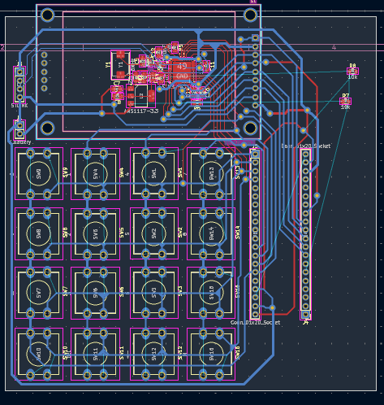

# ComplexCalc — Hardware Version 🔌⚡

**A standalone embedded calculator for complex n×n linear systems (Ax=b)** — no PC required at runtime. Custom STM32F411 PCB with a 16-button keypad and an ILI9341 TFT display, built for electronics students and AC circuit analysis.

> [!NOTE]
> **Work in progress.** Firmware is functional (keypad input, TFT UI, Gauss-Jordan solver); the PCB is still being routed (some ADC connections are pending — see [Design](#-design-pcb)).

---

## 📁 Repository Structure

```
├── code/
│   └── 06ComplexCalcDasProject/   # STM32CubeIDE / CMake firmware project
│       ├── Core/
│       │   ├── Inc/               # ComplexGJ.h (solver), TFT_Screen.h, display_ui.h, ...
│       │   └── Src/                # SWComplexGJ.c (solver), TFT_Screen.c, display_ui.c, main.c, ...
│       └── Drivers/                # Vendored STM32 HAL + CMSIS (ST-generated, not project code)
├── design/
│   └── ComplexCalc/                # KiCad schematic + PCB (in progress)
└── README.md
```

The actual project logic lives in `Core/Inc` / `Core/Src`; everything under `Drivers/` is STM32CubeMX-generated boilerplate.

---

## 🎯 Overview

- **MCU:** STM32F411C(C/E)U (Cortex-M4, UFQFPN48) — the same chip used on "BlackPill" dev boards, but here on a custom PCB, not a plug-in module.
- **Display:** ILI9341 TFT over SPI.
- **Input:** 16-button matrix keypad (4×4), wired directly on the PCB.
- **Power:** coin-cell battery holder + NCP1117-3.3 LDO regulator.
- **Solver:** Gauss-Jordan elimination, single-precision (`float`) complex arithmetic, systems from 2×2 up to 4×4.

No serial terminal, USB host, or PC connection is needed to use the calculator — power it on, and the keypad + screen are the whole interface. (USB/SWD is only used to flash firmware.)

---

## 🚀 Build & Flash

**Using STM32CubeIDE (recommended):**
1. Open STM32CubeIDE.
2. File → Open Projects from File System.
3. Select `code/06ComplexCalcDasProject/`.
4. Build (`Ctrl+B`), then flash over USB/SWD (`Ctrl+Alt+X`).

**Using CMake + the ARM GCC toolchain (also supported by this project):**
```bash
cd code/06ComplexCalcDasProject
cmake --preset Debug      # or: Release
cmake --build --build-preset Debug
```
This uses the project's own `cmake/gcc-arm-none-eabi.cmake` toolchain file — you'll need `arm-none-eabi-gcc` and `ninja` installed.

---

## 🎮 Usage

On power-up, the screen prompts for the system size (`2`–`4`). From there:

| Input | Action |
|---|---|
| `0`–`9` | Enter digits (toggles between real/imaginary part) |
| `=` | Confirm entry / advance |
| `S` + `P` (combo) | Cycle display theme |

Once the full A matrix and b vector are entered, the solver runs on-device and the result is shown on screen — no PC needed.

---

## 🧮 Solver Details

- **Algorithm:** Gauss-Jordan elimination (`solve_complex_system` in `ComplexGJ.h`/`SWComplexGJ.c`).
- **Precision:** single-precision float, `EPSILON = 1e-7` for singularity checks.
- **Maximum size:** 4×4 (`N_MAX`), matching the keypad-driven size range (2–4).
- **Error handling:** returns `SOLVER_ERR_INVALID_SIZE` / `SOLVER_ERR_SINGULAR` for out-of-range sizes or singular matrices.

---

## 🖥️ Design (PCB)

KiCad project at `design/ComplexCalc/` — schematic + PCB for the keypad, MCU, TFT header, and power circuitry.



*Routing in progress — some ADC-related connections are still pending. A rendered board image will replace this screenshot once the layout is finished.*

---

## 🤝 Contributing

1. Firmware changes go in `code/06ComplexCalcDasProject/Core/`.
2. PCB changes go in `design/ComplexCalc/` (KiCad 8+).
3. Open a PR against this repo.

## 📞 Issues

Report bugs or hardware questions via this repo's [Issues](https://github.com/UAA-F14/ComplexCalc-HW/issues).
